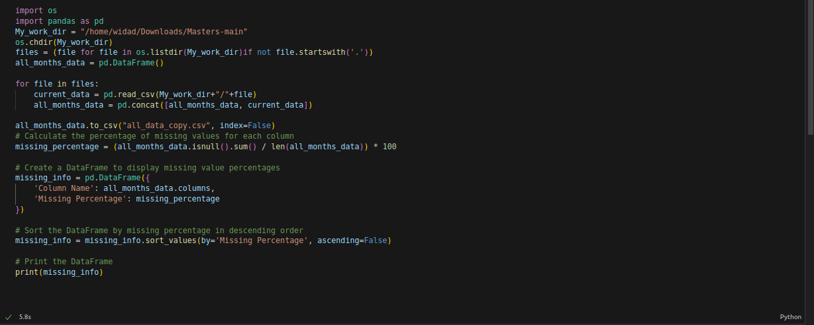
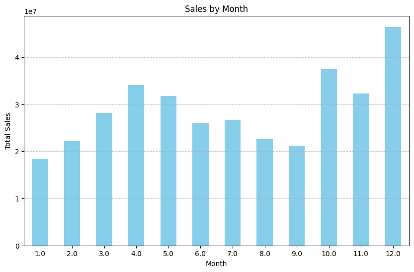

1- we notice that all columns have same missing percentage
2- According to the data visualization, we can say that decembre is the best sale's month, as we see below:

According to analysing the data, this due to the cold weather (winter season) so people need to buy electronics, in addition, they buy gifts to their famillies during the new year.

3- What city sold most product:
